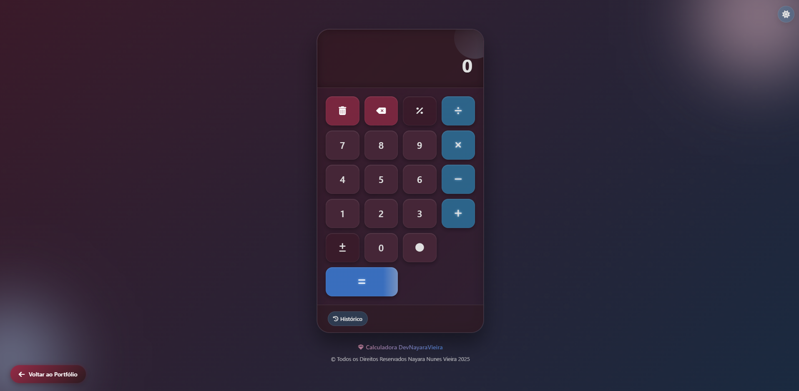
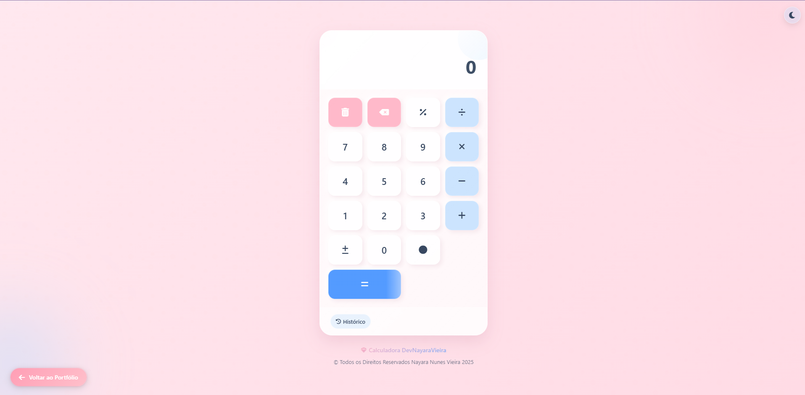

# Projeto Calculadora Profissional
========
# Calculadora Profissional 


Uma calculadora profissional com design elegante e moderno, implementando o estilo Glassmorphism. Desenvolvida com HTML, CSS e JavaScript puros, é perfeita para adicionar ao seu portfólio.

## ✨ Funcionalidades

- **Calculadora Completa**: Suporte para todas as operações matemáticas básicas
- **Tema Claro/Escuro**: Alterna entre tema rosa claro e escuro com detalhes sutis em azul
- **Modo Glassmorphism**: Design moderno com efeitos de vidro translúcido
- **Histórico de Cálculos**: Mantém registro das últimas operações
- **Funções de Memória**: MR, M+, M-, MC para armazenar e manipular valores
- **Suporte a Teclado**: Use o teclado físico para realizar cálculos
- **Totalmente Responsivo**: Adaptado para mobile, tablet e desktop
- **Animações Fluidas**: Efeitos visuais e transições elegantes
- **Persistência**: Salva tema e histórico entre sessões

## 🚀 Tecnologias

- HTML5
- CSS3 (Variáveis CSS, Flexbox, Grid)
- JavaScript (ES6+)
- LocalStorage API
- Media Queries

## 📋 Características do Design

- **Tema Principal**: Rosa bebê com detalhes sutis em azul
- **Estilo Visual**: Glassmorphism com efeitos de blur e transparência
- **Animações**: Fluidas e elegantes para melhor experiência de usuário
- **Responsividade**: Adaptado para todos os tamanhos de tela
- **Acessibilidade**: Suporte a navegação por teclado e redução de movimento

## 🔧 Estrutura do Projeto

```
calculadora-rosa/
│
├── index.html                  # Arquivo HTML principal
│
├── assets/                     # Pasta para todos os recursos
│   │
│   ├── css/                    # Arquivos CSS
│   │   ├── main.css            # Estilos principais
│   │   ├── themes.css          # Estilos dos temas (claro/escuro)
│   │   ├── animations.css      # Animações e transições
│   │   └── responsive.css      # Estilos responsivos
│   │
│   ├── js/                     # Arquivos JavaScript
│   │   ├── calculator.js       # Lógica principal da calculadora
│   │   ├── ui.js               # Interface do usuário e interações
│   │   ├── theme.js            # Gerenciamento de tema
│   │   └── history.js          # Lógica do histórico
│   │
│   └── img/                    # Imagens (se necessário)
│       └── favicons/           # Ícones para o navegador
│
├── README.md                   # Esta documentação
└── LICENSE                     # Licença do projeto
```

## 📱 Capturas de Tela

<!-- Substitua com suas próprias imagens quando disponíveis -->




## 💡 Uso

- Use os botões numéricos para inserir valores
- Botões de operação (+, -, ×, ÷) para cálculos
- Botão = para ver o resultado
- Botão % para calcular porcentagens
- Botões de memória para armazenar valores
- Botão de tema para alternar entre claro e escuro
- Botão de histórico para ver cálculos anteriores

## 🔗 Integração ao Portfólio

Para adicionar à sua página de portfólio:

1. Copie a pasta do projeto para seu site
2. Adicione um link para o projeto em sua página principal
3. Personalize a paleta de cores conforme necessário, modificando as variáveis no arquivo `themes.css`

## 🧩 Personalização

Você pode personalizar facilmente esta calculadora:

1. **Cores**: Altere as variáveis CSS em `themes.css`
2. **Efeitos**: Modifique as animações em `animations.css`
3. **Layout**: Ajuste o layout em `main.css` e `responsive.css`
4. **Funcionalidades**: Expanda a lógica em `calculator.js`

## 🤝 Contribuição

Contribuições são bem-vindas! Sinta-se à vontade para abrir issues ou enviar pull requests.

## 📄 Licença

Este projeto está licenciado sob a [Licença MIT](LICENSE).

## 👤 Autor

DevNayaraVieira - [Protfólio](https://portfolio-devnayaravieira.netlify.app)

---

⭐️ From [DevNayaraVieira](https://github.com/devnayaravieira)
=======
# projeto-calculadora
=======
Nayara - [DevNayaraVieira](https://portfolio-devnayaravieira.netlify.app)

---

⭐️ From [devnayaravieira](https://github.com/devnayaravieira)
